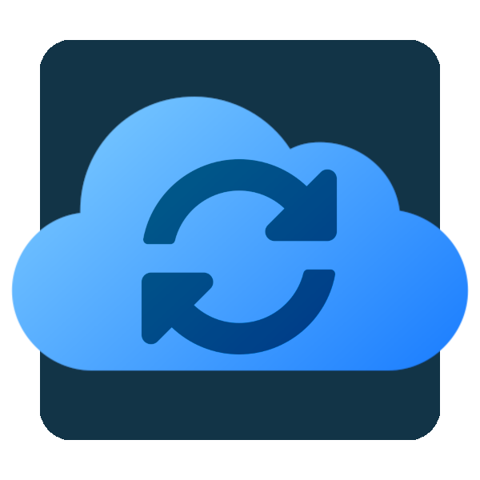

# Network List Sync

[](https://github.com/mstrhakr/network-list-sync/actions/workflows/ci.yml)
[](https://github.com/mstrhakr/network-list-sync/releases/latest)
[](https://goreportcard.com/report/github.com/mstrhakr/network-list-sync)
[](https://github.com/mstrhakr/network-list-sync/blob/main/go.mod)
[](LICENSE)



Network List Sync resolves hostnames to IPs and keeps provider-managed target lists in sync.

It supports multiple endpoint providers in one deployment, currently:

- UniFi
- Nginx Proxy Manager (NPM)

## Features

- Web UI for endpoint, DNS server, and sync job management
- Multi-target jobs (one job can update multiple endpoint/list pairs)
- Provider-aware endpoint model (UniFi and NPM side by side)
- Built-in local authentication with persistent server-side sessions
- First-start admin bootstrap (interactive in UI or via Docker environment)
- Cron scheduling with manual run support
- DNS preview before saving a job
- Hostname plus literal IPv4 and IPv4 CIDR inputs
- External URL list inputs (HTTP/HTTPS), for example Cloudflare IP ranges
- Run history and per-run details
- Single binary with embedded UI and SQLite persistence

## Why Use It

Use this when upstream systems publish hostnames or changing IP ranges and you need list-based access control to stay current automatically.

Common examples:

- Probe/monitoring provider IPs that rotate over time
- Third-party integrations with DNS-based endpoints
- Mixed static and dynamic allow-lists

## How It Works

1. Add one or more endpoints in the UI.
2. Create a sync job with hostnames/IP inputs.
3. Assign a primary target list and optional additional targets.
4. Run manually or on schedule.
5. The service resolves DNS, computes diffs, updates provider lists, and stores run history.

## Before You Start

1. Reachable endpoint URLs for each provider.
2. Credentials/secrets with permission to update target lists.
3. Provider-specific identity value if required:
   - UniFi: site (usually default)
   - NPM: identity/account value used by your environment
4. Existing target list IDs in each provider.
5. Persistent storage for the data directory.

## Authentication

This application is protected by login.

- First startup with no users: visiting `/login` shows an admin account creation form.
- After setup: `/login` shows a standard sign-in form.
- Sessions are server-side and stored in SQLite.

### Docker Initial Admin Bootstrap

To create the first admin account automatically on container startup, set both env vars:

- `NLS_INITIAL_ADMIN_USERNAME`
- `NLS_INITIAL_ADMIN_PASSWORD`

If users already exist, these values are ignored.

## Quick Start

### Docker (Recommended)

Run latest build from main:

```bash
docker run --rm -p 8080:8080 \
  -v network-list-sync-data:/data \
  ghcr.io/mstrhakr/network-list-sync:main
```

Run a stable release:

```bash
docker run --rm -p 8080:8080 \
  -v network-list-sync-data:/data \
  ghcr.io/mstrhakr/network-list-sync:v0.1.0
```

Open http://localhost:8080.

Published platforms: linux/amd64 and linux/arm64.

### Docker Compose (Example)

See [docs/docker-compose.unraid.yml](docs/docker-compose.unraid.yml).

```yaml
services:
  network-list-sync:
    image: ghcr.io/mstrhakr/network-list-sync:main
    container_name: network-list-sync
    restart: unless-stopped
    ports:
      - "8080:8080"
    environment:
      PUID: "99"
      PGID: "100"
      UMASK: "022"
      NLS_INITIAL_ADMIN_USERNAME: "admin"
      NLS_INITIAL_ADMIN_PASSWORD: "change-this-immediately"
    volumes:
      - /mnt/user/appdata/network-list-sync:/data
```

### Run From Source

```bash
go run . -addr :8080
```

### Build Binary

```bash
go build -o network-list-sync .
./network-list-sync
```

## Runtime Flags

| Flag | Default | Description |
|------|---------|-------------|
| -addr | :8080 | HTTP listen address |
| -db | sync.db | SQLite database path |
| -debug | false | Enable debug logs |
| -verbose | false | Enable verbose logs |
| -log-file | sync.log | Log file path (empty disables file logging) |
| -version | false | Print build version metadata and exit |

Environment variables:

| Variable | Description |
|----------|-------------|
| `NLS_INITIAL_ADMIN_USERNAME` | Optional first-run admin username (must be paired with password) |
| `NLS_INITIAL_ADMIN_PASSWORD` | Optional first-run admin password (must be paired with username) |

Example:

```bash
./network-list-sync -addr :9090 -db /var/lib/sync/data.db -log-file ./sync.log
```

## UI Setup Walkthrough

1. Open the app and go to Endpoints.
2. Add at least one endpoint with provider, URL, identity/site, and secret.
3. Test connection and save.
4. Create a new sync job.
5. Choose primary endpoint and primary target list.
6. Add hostnames, IPv4, CIDR, or external URL list entries (one per line).
7. Optionally add additional endpoint/list targets.
8. Save and run the job.
9. Review logs and target list state.

Example input:

```text
# Grafana synthetic probes
synthetics.grafana.net

# Static office egress
203.0.113.10
203.0.113.0/24

# External source list
https://www.cloudflare.com/ips-v4
```

## Operational Tips

1. Validate jobs with manual runs before enabling schedule.
2. Keep data persisted under /data across container upgrades.
3. Use exact release tags in production.
4. Keep endpoint credentials scoped to minimum required permissions.

## API Endpoints

All `/api/*` endpoints require an authenticated session.

### Endpoints/Instances

| Method | Path | Description |
|--------|------|-------------|
| GET | /api/instances | List endpoints |
| POST | /api/instances | Create endpoint |
| GET | /api/instances/{id} | Get endpoint |
| PUT | /api/instances/{id} | Update endpoint |
| DELETE | /api/instances/{id} | Delete endpoint |
| GET | /api/instances/{id}/target-lists | List provider target lists |
| POST | /api/instances/test | Test endpoint connection |

### Jobs

| Method | Path | Description |
|--------|------|-------------|
| GET | /api/jobs | List jobs |
| POST | /api/jobs | Create job |
| GET | /api/jobs/{id} | Get job |
| PUT | /api/jobs/{id} | Update job |
| DELETE | /api/jobs/{id} | Delete job and history |
| GET | /api/jobs/{id}/target-list | Get primary or selected target list state |
| POST | /api/jobs/{id}/run | Trigger immediate run |
| GET | /api/jobs/{id}/logs | Get job run history |

### DNS And Health

| Method | Path | Description |
|--------|------|-------------|
| POST | /api/resolve | Preview DNS resolution |
| GET | /api/health | Health check |
| GET | /api/dns-servers | List DNS servers |
| POST | /api/dns-servers | Create DNS server |
| GET | /api/dns-servers/{id} | Get DNS server |
| PUT | /api/dns-servers/{id} | Update DNS server |
| DELETE | /api/dns-servers/{id} | Delete DNS server |

## Cron Schedule Examples

| Expression | Meaning |
|------------|---------|
| */30 * * * * | Every 30 minutes |
| 0 */6 * * * | Every 6 hours |
| 0 0 * * * | Daily at midnight |
| 0 0 * * 1 | Every Monday |

## References

- Maintainer guide: [docs/development.md](docs/development.md)
- Migration notes: [docs/generic-migration-plan.md](docs/generic-migration-plan.md)
- UniFi schema reference: [docs/reference/unifi-network-10.1.85.json](docs/reference/unifi-network-10.1.85.json)

## OIDC Roadmap

The auth layer includes provider abstractions for both password and OIDC flows.

- Current provider: local password (`local`)
- Planned: OIDC providers can be registered without replacing the existing session model

## License

MIT
